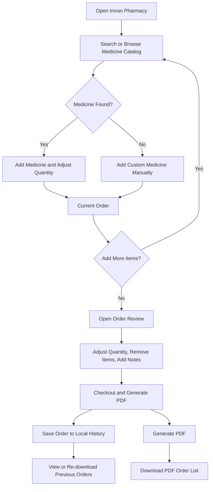
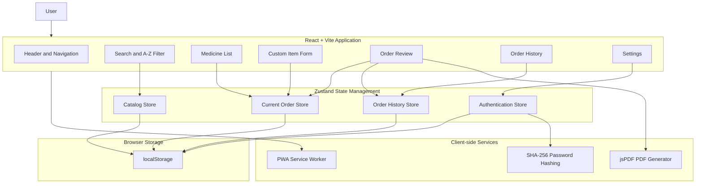

# 💊 Imran Pharmacy

> **An offline-capable Progressive Web App for quickly browsing a large medicine catalog, building quantity-based pharmacy orders, saving order history, and generating downloadable PDF order lists.**

🌐 **Live Application:** [Open Imran Pharmacy](https://imran-pharmacy.vercel.app/)
💻 **Source Code:** [GitHub Repository](https://github.com/shatteredcode69/imran-pharmacy?utm_source=chatgpt.com)

---

## 📌 Overview

**Imran Pharmacy** is a lightweight, installable Progressive Web Application designed to simplify the process of creating and managing medicine orders.

The application was built for a pharmacy workflow where the user needs to quickly search through a large medicine catalog, select medicines, specify quantities, review the order, and generate a clean PDF order list.

Instead of functioning as a traditional e-commerce pharmacy with prices, payments, or online checkout, the application focuses on a specific operational workflow:

> **Find medicines → select quantities → review the order → save it locally → generate a PDF.**

The application contains a catalog of **1,908 medicine names** based on the available pharmacy stock data. It also allows medicines that are not already in the catalog to be added manually.

The project was developed as part of my practical work in AI Fluency and iterative software development. The focus was not only on building a working application, but also on identifying workflow requirements, improving the initial implementation, testing the system, documenting its limitations, and being transparent about where AI-assisted development was used.

---

# 🎯 The Problem

Creating medicine order lists manually can become inefficient when a pharmacy works with a large catalog.

A user may need to:

* Search through hundreds or thousands of medicine names.
* Remember medicines that are frequently ordered.
* Specify quantities for each item.
* Add medicines that are missing from the existing catalog.
* Review the complete order before finalizing it.
* Maintain a record of previous orders.
* Recreate an old order.
* Generate a clean document that can be shared or used for ordering.

A spreadsheet or handwritten process can make these tasks repetitive and time-consuming.

## The Solution

Imran Pharmacy provides a focused digital workflow where the user can:

1. Browse or search a catalog of medicines.
2. Filter medicines alphabetically.
3. Add medicines to an order.
4. Adjust quantities.
5. Add custom medicines manually.
6. Mark frequently used medicines as favorites.
7. Import medicine quantities in bulk through CSV.
8. Add notes to order items.
9. Save reusable order templates.
10. Review the complete order.
11. Generate and download a PDF order list.
12. Save completed orders locally.
13. Re-download PDFs from previous orders.
14. Use the application offline after installation.

The result is a simple, dedicated pharmacy ordering tool rather than a general-purpose e-commerce system.

---

# 👥 Who Is This For?

The primary intended user is a pharmacy operator or staff member who needs to quickly create medicine order lists.

The application is particularly useful for workflows where:

* Medicine prices are not required inside the application.
* The main requirement is **medicine name + quantity**.
* Orders need to be exported as PDFs.
* The user works repeatedly with a large medicine catalog.
* Internet access may not always be available.
* Previous orders need to remain accessible on the same device.

---

# ✨ Key Features

## 🔎 Searchable Medicine Catalog

The application includes **1,908 medicine names** that can be searched in real time.

Users can quickly locate a medicine instead of manually scrolling through the entire catalog.

---

## ➕ Quantity-Based Ordering

Each medicine can be added to the current order using quantity controls.

Users can:

* Increase quantity.
* Decrease quantity.
* Adjust quantities before checkout.
* Remove medicines from the order.

The application intentionally focuses on **what to order and how much**, rather than pricing or payment processing.

---

## ✍️ Custom Medicine Entry

If a medicine is not available in the catalog, the user can manually enter its name and quantity.

This prevents the fixed catalog from becoming a complete limitation.

---

## 🔤 A–Z Filtering

Medicines can be filtered alphabetically.

The application provides:

* A–Z filters.
* An additional **Other** category for items that do not begin with a standard alphabetic character.

---

## ⭐ Favorites

Frequently used medicines can be marked as favorites.

This allows common items to be surfaced more conveniently during repeated ordering workflows.

---

## 📄 CSV Batch Import

The application supports bulk importing medicines and quantities through a CSV file.

Expected format:

```csv
name,qty
Panadol 500mg Tab,10
Augmentin 625mg,5
Vitamin D,3
```

This allows larger orders to be added without manually searching for every individual medicine.

---

## 📝 Prescription or Order Notes

Notes can be attached to individual order items before checkout.

This provides additional context when the generated order needs to communicate something beyond the medicine name and quantity.

---

## 📋 Reusable Order Templates

Users can save the current order as a reusable template.

This is useful for recurring or frequently repeated medicine orders.

---

## 🛒 Order Review

Before finalizing the order, the user can open the order review drawer and:

* Review all selected medicines.
* Adjust quantities.
* Remove items.
* Add notes.
* Check the final order before generating the PDF.

---

## 📥 PDF Generation

When an order is checked out:

1. The order is saved to local order history.
2. A PDF order list is generated.
3. The PDF is downloaded automatically.

Previous orders can also regenerate their PDFs later.

---

## 🕒 Order History

Completed orders are stored locally on the device.

Users can:

* View previous orders.
* Expand an order to inspect it.
* Re-download its PDF.
* Delete orders when they are no longer needed.

---

## 📱 Installable Progressive Web App

Imran Pharmacy is a Progressive Web App.

This means it can be installed on compatible:

* Mobile devices.
* Tablets.
* Desktop systems.

After the initial application load and installation, the application can continue to work offline because the core application assets are cached locally.

---

## 🔐 Password Gate

The application includes a password gate to prevent casual access on a shared device.

Features include:

* First-run password setup.
* Returning-user login.
* Password hashing using SHA-256.
* Password change functionality.
* Manual locking.
* Password reset functionality.

### Important Security Limitation

This password mechanism is designed as a **privacy layer for a shared device**, not as enterprise-grade authentication.

Because the application is completely client-side and uses browser storage, a determined person with direct access to the device and browser developer tools could potentially inspect or clear local application data.

This is discussed further in the **Limitations** section.

---

## 🌙 Dark and Light Mode

The application supports both dark and light themes for user preference and usability.

---

# 🏗️ How It Works

The core workflow is straightforward:

```text
Open Application
      ↓
Search or Browse Medicines
      ↓
Select Medicine and Quantity
      ↓
Add More Medicines or Custom Items
      ↓
Review Complete Order
      ↓
Adjust Quantities / Add Notes
      ↓
Checkout
      ↓
Save Order Locally
      ↓
Generate PDF
      ↓
Download Order List
```

---

# 🔄 User Workflow



---

# 🧩 System Architecture

Imran Pharmacy uses a client-side architecture.

The application does not require a traditional backend server or database for its core functionality.



---

# 🧠 Architecture Explanation

## 1. Frontend

The frontend is built with **React** and bundled using **Vite**.

It handles:

* Navigation.
* Medicine search.
* Alphabetical filtering.
* Quantity controls.
* Order review.
* History management.
* Settings.
* Theme switching.

---

## 2. State Management

The application uses **Zustand** for client-side state management.

Separate stores manage:

* Current order.
* Order history.
* Authentication state.
* Medicine catalog state.

The relevant state is persisted using browser `localStorage`.

---

## 3. Medicine Catalog

The base medicine catalog is stored as static JSON data.

Each medicine includes:

```json
{
  "id": 1,
  "name": "Panadol 500mg Tab"
}
```

The static catalog allows the application to function without requiring an external API for medicine lookup.

---

## 4. PDF Generation

The application uses **jsPDF** and related PDF table functionality to generate downloadable order documents.

PDF generation happens entirely in the browser.

No order data needs to be sent to a server.

---

## 5. Browser Storage

The application uses `localStorage` to persist:

* Current orders.
* Saved order history.
* Favorites.
* Templates.
* Catalog additions.
* Password-related state.

This allows data to remain available after:

* Refreshing the page.
* Closing and reopening the browser.
* Restarting the installed application.

However, this storage is limited to the specific browser and device.

---

## 6. Progressive Web App Layer

The PWA configuration allows the application to be installed and used like a native application.

The service worker caches application assets to support offline usage after the application has been loaded.

---

# 🛠️ Technology Stack

| Technology      | Purpose                         |
| --------------- | ------------------------------- |
| React           | User interface                  |
| Vite            | Development and build tooling   |
| Tailwind CSS    | Application styling             |
| Zustand         | Client-side state management    |
| localStorage    | Persistent browser storage      |
| jsPDF           | PDF generation                  |
| Web Crypto API  | SHA-256 password hashing        |
| vite-plugin-pwa | Progressive Web App support     |
| JavaScript      | Core application logic          |
| Vercel          | Deployment and hosting          |
| GitHub          | Source code and version control |

---

# 📁 Project Structure

```text
imran-pharmacy/
│
├── index.html
├── package.json
├── package-lock.json
├── vite.config.js
├── tailwind.config.js
├── postcss.config.js
├── README.md
│
├── public/
│   ├── icon-192x192.png
│   └── icon-512x512.png
│
└── src/
    │
    ├── main.jsx
    ├── App.jsx
    ├── index.css
    │
    ├── data/
    │   └── medicines.json
    │
    ├── store/
    │   ├── useAuthStore.js
    │   ├── useCartStore.js
    │   ├── useCatalogStore.js
    │   └── useHistoryStore.js
    │
    ├── lib/
    │   ├── hashPassword.js
    │   ├── pdfGenerator.js
    │   ├── formatDate.js
    │   └── useTheme.js
    │
    └── components/
        │
        ├── auth/
        │   ├── LoginGate.jsx
        │   ├── SetPasswordScreen.jsx
        │   └── LoginScreen.jsx
        │
        ├── layout/
        │   └── Header.jsx
        │
        ├── catalog/
        │   ├── SearchBar.jsx
        │   ├── MedicineList.jsx
        │   ├── CustomItemForm.jsx
        │   ├── CatalogManager.jsx
        │   └── CsvImport.jsx
        │
        ├── order/
        │   ├── FloatingFooter.jsx
        │   └── TemplateManager.jsx
        │
        ├── history/
        │   └── HistoryView.jsx
        │
        ├── settings/
        │   └── SettingsPage.jsx
        │
        ├── info/
        │   ├── AboutPage.jsx
        │   └── FeatureGuide.jsx
        │
        └── common/
            └── QuantityStepper.jsx
```

---

# 🚀 Getting Started

Follow these steps to reproduce the project locally.

## Prerequisites

You need:

* Node.js 18 or newer.
* npm.
* Git.

Check your installation:

```bash
node -v
npm -v
git --version
```

---

# 📥 Installation

## 1. Clone the Repository

```bash
git clone https://github.com/shatteredcode69/imran-pharmacy.git
```

Move into the project directory:

```bash
cd imran-pharmacy
```

---

## 2. Install Dependencies

```bash
npm install
```

This installs all required dependencies, including React, Vite, Tailwind CSS, Zustand, jsPDF, and the PWA plugin.

---

# ▶️ Run the Application

Start the development server:

```bash
npm run dev
```

Vite will provide a local development URL, usually:

```text
http://localhost:5173
```

Open the URL in your browser.

---

# 🧪 Build for Production

To create an optimized production build:

```bash
npm run build
```

The production files will be generated inside:

```text
dist/
```

To preview the production build locally:

```bash
npm run preview
```

---

# 📖 Usage Guide

## 🔐 Step 1 — Set a Password

On the first run, the application asks the user to create a password.

The password is hashed before storage.

After the password is created, the application unlocks for the current session.

---

## 🔎 Step 2 — Find a Medicine

Use the search bar to search through the medicine catalog.

The results update in real time.

You can also use the A–Z filter to browse medicines alphabetically.

---

## ➕ Step 3 — Add Medicine and Quantity

Click the `+` button next to a medicine to add it to the current order.

Use the quantity controls to:

* Increase quantity.
* Decrease quantity.
* Modify the amount before checkout.

---

## ✍️ Step 4 — Add a Medicine Not in the Catalog

If the medicine cannot be found:

1. Open the manual medicine entry section.
2. Enter the medicine name.
3. Enter the required quantity.
4. Add it to the current order.

---

## ⭐ Step 5 — Use Favorites

Frequently used medicines can be marked as favorites.

Favorites are useful for reducing repeated search effort during regular ordering.

---

## 📄 Step 6 — Import Medicines Using CSV

Create a CSV file in this format:

```csv
name,qty
Panadol 500mg Tab,10
Augmentin 625mg,5
Vitamin D,3
```

Upload the CSV through the application's import functionality.

The medicines and quantities will be added to the current order.

---

## 📝 Step 7 — Add Notes

Before checkout, notes can be attached to order items.

These notes provide additional information that may be useful when reviewing or communicating the order.

---

## 📋 Step 8 — Save an Order Template

If a similar order is used repeatedly:

1. Build the order.
2. Save it as a template.
3. Give the template a recognizable name.
4. Apply the template later when needed.

---

## 🛒 Step 9 — Review the Order

Open the order review section.

Here you can:

* View all selected medicines.
* Adjust quantities.
* Remove items.
* Review notes.

---

## 📥 Step 10 — Checkout and Generate PDF

Select:

```text
Checkout & Generate PDF
```

The application will:

1. Save the order to local history.
2. Generate a PDF.
3. Download the PDF.
4. Clear the current order.

---

## 🕒 Step 11 — View Order History

Open the **History** section.

You can:

* Review previous orders.
* Expand an order.
* Re-download its PDF.
* Delete an order.

---

# 🧪 Evaluation Methodology

A working application alone does not prove that the workflow is effective.

The project should therefore be evaluated using realistic pharmacy ordering scenarios.

The evaluation focuses on whether the application successfully supports the intended workflow:

> **Find → Add → Adjust → Review → Save → Generate PDF**

## Evaluation Scenarios

The system can be tested using scenarios such as:

### Scenario 1 — Search Existing Medicine

**Task:** Find a medicine already available in the 1,908-item catalog.

**Expected Result:**
The medicine appears through search or alphabetical filtering and can be added to the order.

---

### Scenario 2 — Add Multiple Quantities

**Task:** Add a medicine and modify its quantity.

**Expected Result:**
The quantity updates correctly in both the medicine view and the order review.

---

### Scenario 3 — Medicine Not in Catalog

**Task:** Order a medicine that is not available in the static catalog.

**Expected Result:**
The user can manually enter the medicine name and quantity.

---

### Scenario 4 — Large Order

**Task:** Add multiple medicines to a single order.

**Expected Result:**
All medicines remain visible in the order review and can be edited before checkout.

---

### Scenario 5 — CSV Import

**Task:** Import a batch of medicines and quantities.

**Expected Result:**
The imported data is added correctly to the current order.

---

### Scenario 6 — PDF Generation

**Task:** Complete checkout.

**Expected Result:**
The order is saved locally and a PDF order list is generated and downloaded.

---

### Scenario 7 — Order History Persistence

**Task:** Complete an order, close the application, and reopen it.

**Expected Result:**
The completed order remains available in local order history.

---

### Scenario 8 — Offline Availability

**Task:** Install or load the application and test core functionality without an active internet connection.

**Expected Result:**
The cached application continues to provide its core client-side functionality.

---

# 📊 V2 Evaluation Results

The FlyRank assignment requires evaluation results to be visible rather than hidden.

For this project, the evaluation should compare the first version of the workflow with the improved Version 2.

> **Important:** Replace the values below with your actual tested results. Do not invent percentages simply to make the project appear stronger.

| Evaluation Metric                   |              V1 |              V2 | Result          |
| ----------------------------------- | --------------: | --------------: | --------------- |
| Successful medicine search          | [Actual result] | [Actual result] | [Improved/Same] |
| Successful quantity adjustment      | [Actual result] | [Actual result] | [Improved/Same] |
| Successful custom medicine addition | [Actual result] | [Actual result] | [Improved/Same] |
| Successful CSV import               | [Actual result] | [Actual result] | [Improved/Same] |
| Successful PDF generation           | [Actual result] | [Actual result] | [Improved/Same] |
| Order persistence after reload      | [Actual result] | [Actual result] | [Improved/Same] |
| User workflow completion            | [Actual result] | [Actual result] | [Improved/Same] |

## V2 Improvements

The second iteration expanded the application beyond a basic medicine selection interface.

The improved workflow includes capabilities such as:

* Favorites.
* Custom medicine entry.
* A–Z filtering.
* CSV batch import.
* Prescription or item notes.
* Reusable order templates.
* Persistent order history.
* PDF regeneration.
* Password protection.
* Dark and light mode.
* Installable PWA functionality.

These improvements were intended to reduce friction in repeated pharmacy ordering tasks and make the application more useful beyond a single one-time order.

---

# 🧠 Key Design Decision

## Design Decision: Client-Side and Offline-First Architecture

One of the most important design decisions was to build the application as a **fully client-side Progressive Web App**.

Instead of introducing a backend server and database, the application uses:

* React for the interface.
* Zustand for state management.
* Browser `localStorage` for persistence.
* jsPDF for document generation.
* PWA caching for offline availability.

### Why This Decision Was Made

The primary workflow does not require complex server-side processing.

The user mainly needs to:

* Search a static medicine catalog.
* Build an order.
* Save order history.
* Generate PDFs.

A client-side architecture makes the application:

* Lightweight.
* Easier to deploy.
* Faster to start.
* Capable of working offline.
* Independent of a backend server for its core workflow.

### The Trade-Off

This decision also introduces important limitations.

Because there is no central backend:

* Data does not synchronize between devices.
* Clearing browser storage can erase locally stored orders.
* There is no centralized user account.
* The password system is not enterprise-grade authentication.
* Multi-user collaboration is not supported.

This trade-off was accepted because the project's primary goal was to create a simple and practical single-device pharmacy ordering workflow.

---

# ⚠️ Limitations

Being transparent about limitations is an important part of this project.

## 1. No Cross-Device Synchronization

Order history and application data are stored locally.

If the application is used on:

* A phone.
* A different computer.
* Another browser.

The data will not automatically synchronize.

Each device maintains its own local data.

---

## 2. Browser Data Can Be Lost

The application relies on `localStorage`.

If the user:

* Clears browser data.
* Clears site storage.
* Resets the browser.

The locally stored orders, templates, and other application data may be lost.

A future version should provide backup and synchronization through a secure backend.

---

## 3. Password Protection Is Not Enterprise Security

The password is intended to prevent casual access on a shared device.

However, because the application is completely client-side:

* There is no server-side authentication.
* There is no centralized identity system.
* A technically knowledgeable person with direct access to the device may be able to manipulate browser storage.

Therefore, this should be considered a **privacy convenience feature**, not strong security or access control.

---

## 4. Static Medicine Catalog

The medicine catalog is bundled into the application.

It does not automatically update from:

* Suppliers.
* Pharmacy inventory systems.
* Manufacturers.
* External medicine databases.

Catalog changes currently require updating the application data and deploying a new version.

---

## 5. No Real-Time Inventory Tracking

The application does not currently track:

* Available stock.
* Medicine expiry dates.
* Supplier availability.
* Warehouse inventory.
* Real-time price changes.

The system focuses specifically on creating medicine order lists.

---

## 6. No Pricing or Payment System

The application intentionally does not include:

* Medicine prices.
* Shopping cart totals.
* Payment processing.
* Online transactions.

The output is an order list rather than a complete pharmacy e-commerce checkout.

---

## 7. No Multi-User Collaboration

The current architecture is optimized for individual or single-device usage.

Multiple pharmacy employees cannot currently:

* Share a synchronized order.
* View a centralized order history.
* Collaborate on the same account.

---

# 🔮 Future Improvements

A future version could introduce the following improvements.

## ☁️ Cloud Synchronization

Add a backend and database to synchronize:

* Orders.
* Templates.
* Favorites.
* Catalog changes.

Across multiple devices.

---

## 👥 User Accounts

Introduce secure authentication with individual accounts.

This would allow:

* Multiple users.
* Role-based access.
* Personalized data.
* Centralized management.

---

## 📦 Real-Time Inventory Integration

Connect the application with a pharmacy inventory system.

Possible additions:

* Current stock levels.
* Low-stock alerts.
* Supplier availability.
* Automatic reordering suggestions.

---

## 📅 Expiry Tracking

Track:

* Medicine batches.
* Expiry dates.
* Near-expiry alerts.

---

## 💰 Pricing Support

Add optional:

* Medicine prices.
* Order totals.
* Supplier price comparison.
* Cost reports.

---

## 📊 Analytics Dashboard

A future dashboard could show:

* Most frequently ordered medicines.
* Ordering trends.
* Frequently used templates.
* Order volume.
* Historical comparisons.

---

## 🤖 AI-Assisted Features

Potential AI improvements could include:

* Natural-language medicine search.
* Intelligent medicine matching.
* Duplicate detection.
* OCR-based prescription extraction.
* Smart order suggestions based on previous orders.

Any future AI functionality would require careful evaluation, especially because medicine-related workflows can be sensitive to incorrect outputs.

---

# 🤖 AI Transparency

AI tools were used as **development and thinking partners** during this project.

AI assistance was used for activities such as:

* Brainstorming the application structure.
* Exploring implementation approaches.
* Assisting with React component development.
* Debugging issues.
* Improving code structure.
* Refining UI and workflow ideas.
* Generating and improving documentation.
* Reviewing possible limitations and design trade-offs.

However, AI-generated output was **not accepted blindly**.

I was responsible for:

* Defining the project requirements.
* Understanding the pharmacy ordering workflow.
* Making architectural decisions.
* Running the application.
* Testing the features.
* Checking generated code.
* Fixing issues.
* Verifying that the workflow actually worked.
* Reviewing the final implementation.
* Identifying and documenting the project's limitations.

AI accelerated development, but the responsibility for validating the final project and its claims remained with me.

---

# 👨‍💻 What I Built vs. Where AI Assisted

## What I Built and Verified

I was responsible for the project implementation and validation, including:

* Building the pharmacy ordering workflow.
* Structuring the medicine catalog.
* Implementing quantity-based ordering.
* Adding search and alphabetical filtering.
* Implementing custom medicine entry.
* Managing application state.
* Persisting data locally.
* Implementing order history.
* Generating PDF orders.
* Adding reusable templates.
* Supporting CSV import.
* Implementing application settings.
* Configuring the application as a Progressive Web App.
* Testing the user workflow.

## Where AI Assisted

AI was used to assist with:

* Development ideas.
* Code suggestions.
* Debugging.
* Component structure.
* Documentation.
* Explaining technical decisions.
* Identifying possible improvements.

## What I Personally Checked

Before considering the project complete, I verified:

* The application runs successfully.
* Medicine search works.
* Quantities can be changed.
* Custom medicines can be added.
* Orders can be reviewed.
* Orders can be saved locally.
* PDFs can be generated.
* Previous orders can be accessed.
* The application can be deployed and accessed online.
* The documented limitations accurately reflect the current architecture.

---


---

# 🔗 Project Links

| Resource              | Link                                              |
| --------------------- | ------------------------------------------------- |
| Live Application      | https://imran-pharmacy.vercel.app/                |
| Source Code           | https://github.com/shatteredcode69/imran-pharmacy |

---

# 📋 Assignment 8.1 Checklist

## Documentation

* [x] Explains what the project does.
* [x] Identifies who the project is for.
* [x] Provides setup instructions.
* [x] Includes installation commands.
* [x] Includes usage examples.
* [x] Includes an architecture sketch.
* [x] Explains the technical stack.
* [x] Documents the project structure.
* [x] Includes an evaluation methodology.
* [ ] Add actual V2 evaluation results.
* [x] Documents a major design decision.
* [x] Includes a transparent limitations list.
* [x] Includes an AI transparency statement.
* [x] Includes future improvements.


---

# 📚 Key Lessons

This project reinforced several important lessons.

## 1. A Working Application Is Not Automatically a Complete Solution

Building the interface was only the first part.

The project also required thinking about:

* The actual user workflow.
* Data persistence.
* Offline use.
* Repeated ordering.
* Error cases.
* Architectural trade-offs.

---

## 2. Simplicity Can Be a Deliberate Design Decision

The application does not attempt to become a complete pharmacy ERP or e-commerce platform.

Instead, it focuses on one core workflow:

> **Create and manage medicine order lists efficiently.**

Keeping the scope focused made it possible to build a lightweight application that works without a backend.

---

## 3. Architecture Creates Trade-Offs

The offline-first, client-side architecture provides simplicity and privacy advantages.

However, it also creates limitations around:

* Synchronization.
* Data backup.
* Multi-user access.
* Strong authentication.

Understanding these trade-offs was an important part of the project.

---

## 4. AI Outputs Still Require Verification

AI-assisted development can accelerate building and problem-solving.

However, generated suggestions and code must still be:

* Reviewed.
* Tested.
* Debugged.
* Adapted to the actual project requirements.

The final responsibility remains with the developer.

---

# 👤 Author

**Safar**

Computer Science Student
AI, Cloud, and Software Development Enthusiast

**GitHub:** [shatteredcode69](https://github.com/shatteredcode69?utm_source=chatgpt.com)

---

# 📄 License

This project is available for educational and portfolio purposes.

---

# 🙏 Acknowledgment

This project was documented and prepared as part of the **FlyRank AI Fluency Internship**.

The project emphasizes an iterative approach to building with AI:

```mermaid
flowchart LR

    A[Identify Workflow Problem]
        --> B[Design Solution]

    B --> C[Build Initial Version]

    C --> D[Test Real Workflow]

    D --> E[Identify Limitations]

    E --> F[Improve to Version 2]

    F --> G[Evaluate Results]

    G --> H[Document Honestly]

    H --> I[Demo the Real Application]
```



---

## Final Note

Imran Pharmacy is a focused pharmacy ordering application designed around a practical workflow: finding medicines, selecting quantities, reviewing orders, and generating reusable PDF order lists.

The current version demonstrates a working client-side, offline-capable solution with persistent local order history and additional workflow features such as favorites, templates, CSV import, notes, and password-based privacy protection.

At the same time, the project has clear limitations, particularly around cloud synchronization, centralized data storage, multi-user support, real-time inventory, and strong server-side authentication.

These limitations are not hidden. They define the boundary between the current prototype and a potential future production version.
