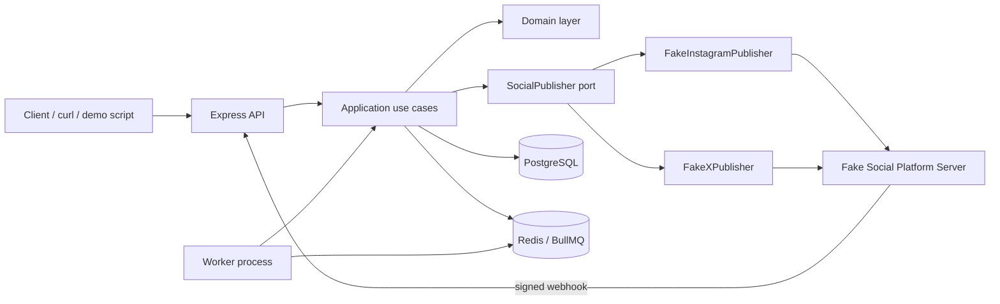
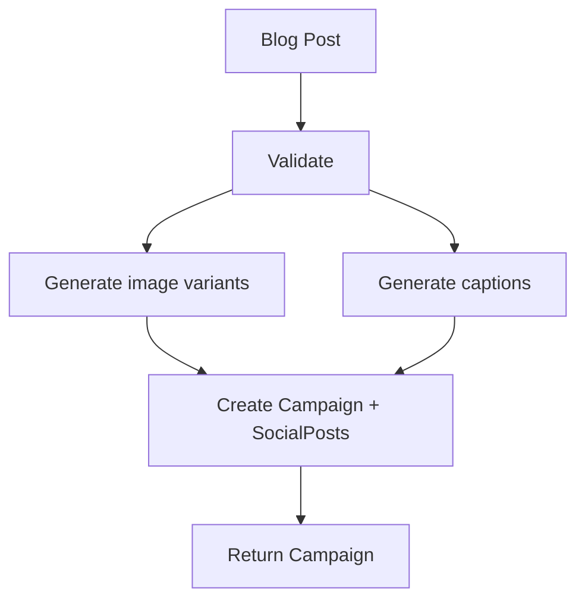
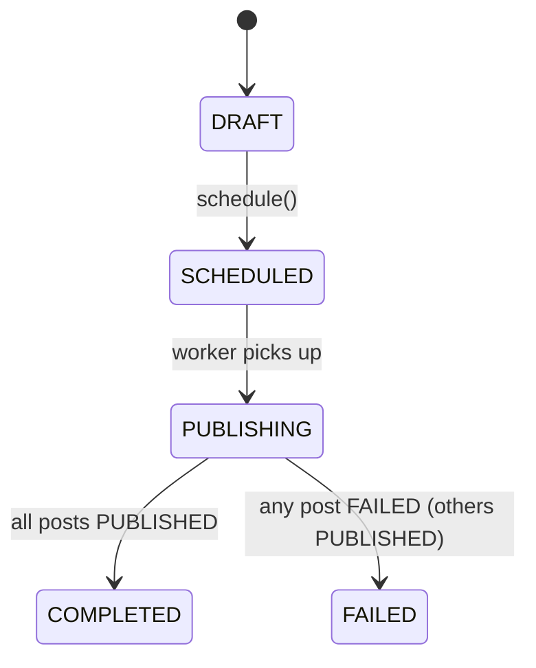
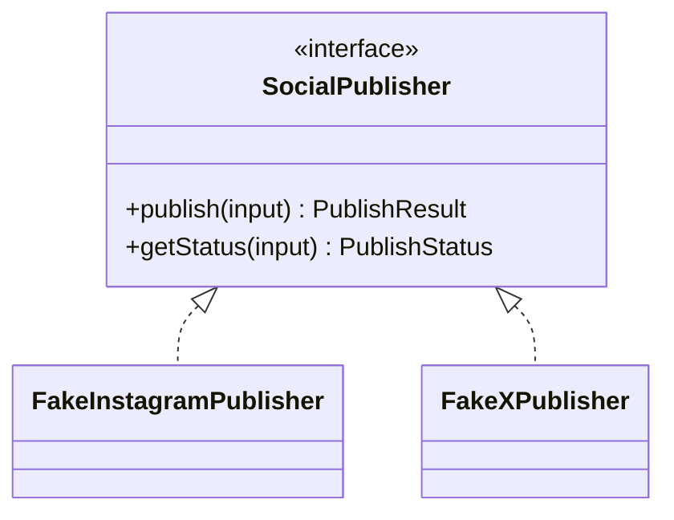
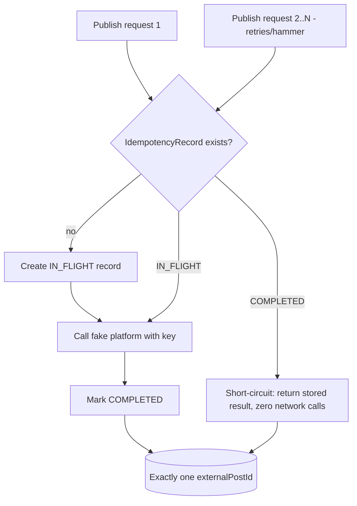
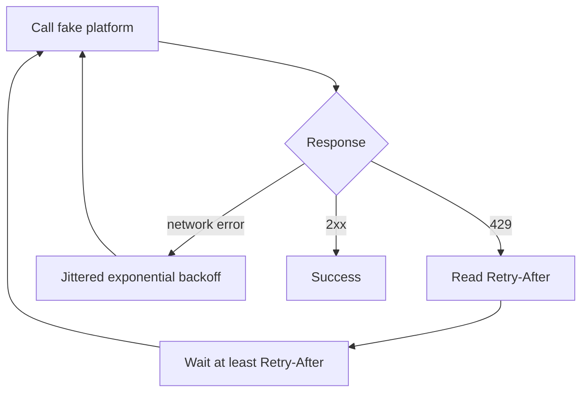
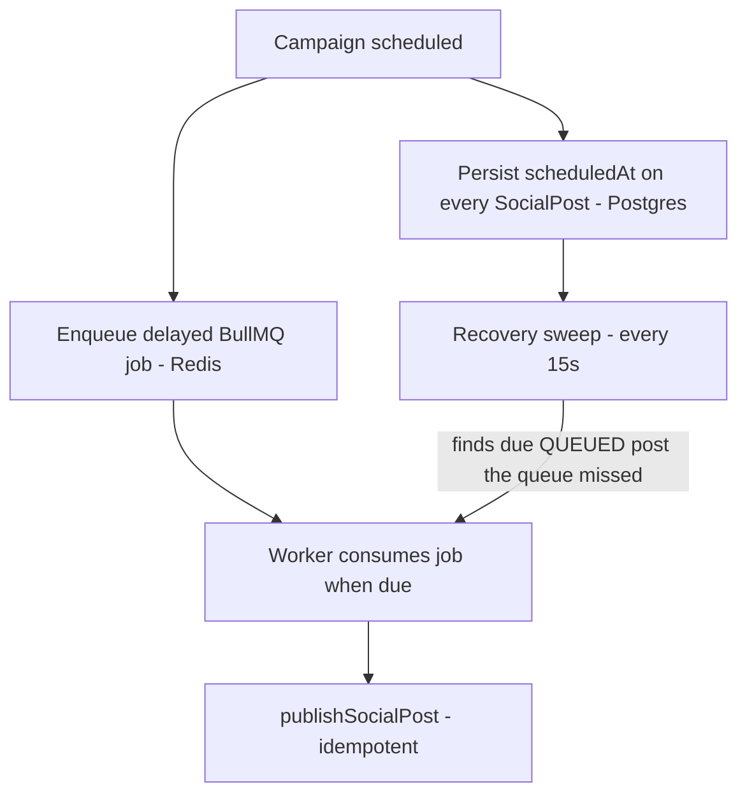
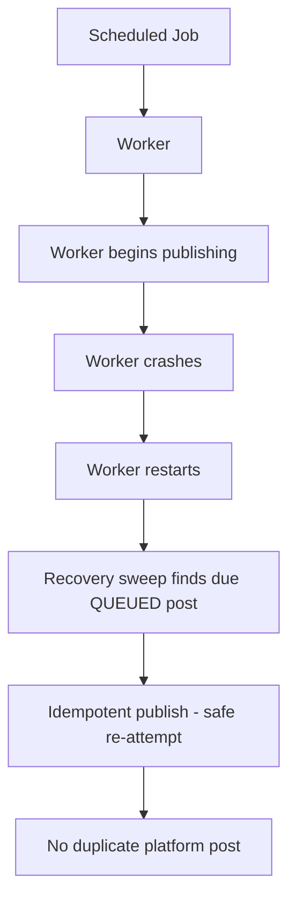
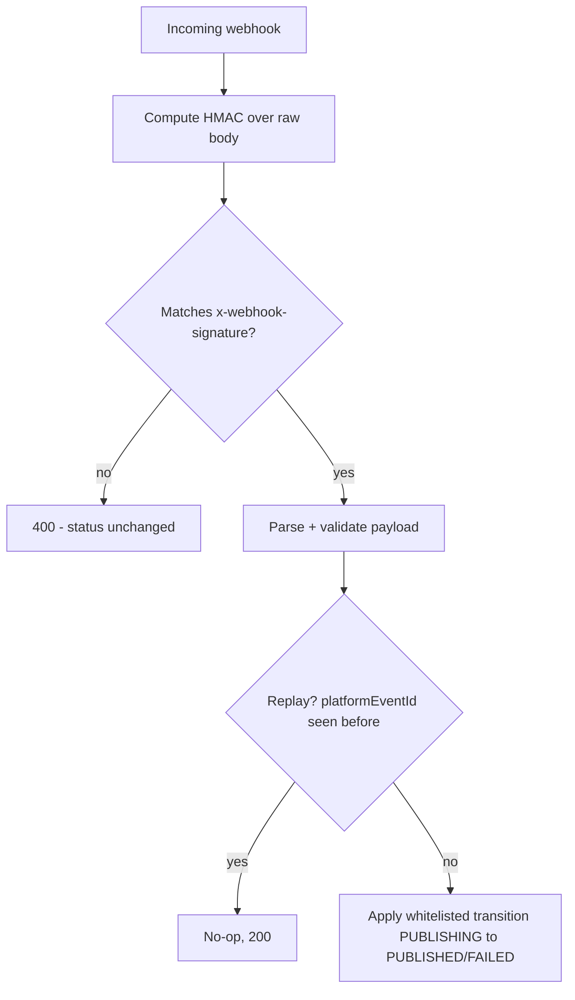

# Multi-Platform Social Campaign Publisher

> FlyRank Internship · Backend Track · Capstone. Turns one published blog post into a
> scheduled, idempotent, rate-limit-aware, signature-verified multi-platform social campaign —
> published entirely against a fake social platform server. No real Instagram/X account is
> ever touched.

## Hero / Overview

Given a blog post (title + body + URL + source image), this service generates the correct
image variant and caption for Instagram and X, schedules the posts, and publishes them through
a clean adapter layer that survives duplicate requests, network timeouts, rate limits, and
worker crashes — flipping a post's status to `PUBLISHED` only once a signature-verified
delivery webhook confirms it.

## Problem

Publishing to social media isn't hard. Publishing **reliably** — where a retry never
double-posts, a scheduled campaign survives a crash, and "published" actually means
"delivered, provably" — is a distributed-systems problem wearing a marketing costume.

## Solution

A layered backend (`HTTP → Application → Domain → Ports → Adapters`) with exactly one
`SocialPublisher` interface, two adapters (`FakeInstagramPublisher`, `FakeXPublisher`), a
durable BullMQ-backed scheduler with a Postgres-truth recovery sweep, AES-256-GCM token
encryption, and HMAC-verified delivery webhooks as the sole path to a `PUBLISHED` status.

## Why this project is interesting

The three hard parts the brief calls out are genuinely hard, and this repo doesn't dodge any
of them: idempotency across a simulated network timeout, a worker that resumes safely after a
crash, and a trust boundary where forged input has provably zero side effects. See
`docs/reliability.md` and `docs/security.md` for exactly how each is handled.

## Features

- Deterministic image-variant pipeline: Instagram 1080×1080 (1:1), X 1600×900 (16:9), safe-zone
  aware crop (`fit: cover` + `attention` gravity), optional brand overlay.
- Composable captions: shared brand voice + per-platform rules + content summary → distinct
  captions per platform, zero AI dependency required (deterministic local fallback).
- One `SocialPublisher` port, two adapters, a registry — adding a platform never touches
  `application/`.
- Idempotent publishing anchored on a deterministic key, safe across retries and simulated
  timeouts.
- 429/`Retry-After` handling with jittered exponential-backoff fallback.
- AES-256-GCM token encryption at rest, random IV per encryption, never logged.
- Durable BullMQ scheduling + a Postgres-backed recovery sweep for crash recovery.
- HMAC-SHA256 signed delivery webhooks, timing-safe verified, replay-protected — forged
  webhooks get `400` with zero side effects.
- A from-scratch fake social platform server (see Engineering Decisions) simulating OAuth,
  rate limits, idempotency, and signed webhook delivery.

## Architecture

```
HTTP (Express) → Application (use cases) → Domain → Ports (SocialPublisher) → Adapters → Fake Platform / Postgres / Redis
```

See `docs/architecture.md` for the full breakdown.

## System Architecture



## Request / Publish Workflow



## Campaign Lifecycle



## Image Pipeline

See `docs/architecture.md` and `src/infrastructure/image/image-variant-generator.ts`. One
data-driven function (`generateVariant`), driven by `PLATFORM_IMAGE_SPECS` — no
`if (platform === ...)` branching.

## Caption Composition

```
Shared Brand Voice  +  Platform Rules  +  Content Summary  →  Platform Caption
```

`src/config/social-prompts.config.ts` (fragments as data) + `src/application/campaigns/compose-caption.ts`
(composition). Deterministic and AI-free by default; see § "AI Usage" below.

## Adapter Architecture



## Idempotency Flow



## Rate-Limit / Retry Flow



## Durable Scheduling



## Crash Recovery



## Webhook Verification



## Security Architecture

See `docs/security.md`.

## Database Architecture

See `docs/database.md` for the full ER diagram and invariants.

## Project Structure

```
multi-platform-social-campaign-publisher/
├── README.md  BUILDLOG.md  EVIDENCE.md  capstone.yaml  LICENSE  .env.example
├── docker-compose.yml  Dockerfile  Dockerfile.worker
├── docs/                    architecture, api, database, security, reliability, development, testing, openapi.yaml
├── prisma/                  schema.prisma, migrations/
├── src/
│   ├── config/               env.ts, social-prompts.config.ts
│   ├── domain/                campaign/, social-post/, platform/
│   ├── application/            campaigns/, publishing/, scheduling/, webhooks/
│   ├── infrastructure/          database/, redis/, queue/, crypto/, image/, platforms/
│   ├── interfaces/http/          routes/, controllers/, middleware/, schemas/
│   └── shared/                    errors/, logging/, utilities/
├── worker/                  worker.ts, processors/
├── fake-platform/           standalone fake social platform server (own package.json/Dockerfile)
├── scripts/                 seed.ts, reset.ts
├── storage/generated/       generated image variants
└── tests/                   unit/, integration/, e2e/, fixtures/
```

## Technology Stack

TypeScript, Node.js, Express, Zod · PostgreSQL + Prisma · Redis + BullMQ · Sharp · AES-256-GCM
+ HMAC-SHA256 (Node `crypto`) · Vitest + Supertest · OpenAPI + Swagger UI · Docker Compose ·
ESLint + Prettier.

## Prerequisites

Docker + Docker Compose (recommended). See `docs/development.md` for a no-Docker path.

## Environment Configuration

See `.env.example` — every variable documented, validated at boot by `src/config/env.ts`.

## Local Development

See `docs/development.md`.

## Docker Setup

```bash
cp .env.example .env
export WEBHOOK_SECRET=<same value as in .env>
docker compose up --build
```

## Database Setup

```bash
docker compose exec api npm run db:migrate
```

## Redis Setup

Provided by `docker-compose.yml` (`redis:7-alpine`) — no manual setup needed.

## Fake Platform Setup

Provided by `docker-compose.yml` (`fake-platform` service, built from `fake-platform/`) — no
manual setup needed. See "Engineering Decisions" below for why it's included from scratch.

## Seed Demo Data

```bash
docker compose exec api npm run db:seed
```

## API Reference

See `docs/api.md` and the live Swagger UI at `/docs`.

## Example Requests / Responses

See `docs/api.md`.

## Testing

```bash
docker compose exec api npm test
```

See `docs/testing.md` for the unit/integration/e2e breakdown.

## Acceptance Tests

Mapped 1:1 to the brief's six probes in `tests/e2e/`. Status of each: see `EVIDENCE.md`.

## Failure Scenarios

Covered by design: platform `429`s, network timeouts mid-publish, worker crash mid-batch,
forged webhooks, tampered ciphertext. See `docs/reliability.md` and `docs/security.md`.

## Screenshots / Evidence

See "Screenshots & Proof" below and `EVIDENCE.md`.

## Definition of Done

Tracked exhaustively in `EVIDENCE.md`, one row per checkbox from the brief's §6.

## Engineering Decisions

- **No starter repository was available to inspect** (`starters/challenge-5-social/`,
  `config/social-prompts.config.ts`, etc. do not exist in this workspace). Per the master build
  prompt's own rule ("if something is not specified by the PDF, make a reasonable engineering
  decision and document it"), all of the following were built from scratch, reconstructed
  strictly from the brief's written specification rather than any real FlyRank source:
  - The entire fake social platform server (`fake-platform/`) — OAuth stub, rate limiting,
    idempotency-aware publish endpoints, signed webhook dispatch.
  - `config/social-prompts.config.ts` — shape inferred from the brief's description
    ("platform voice as data... shared brand voice + platform rules + content summary").
  - `lib/serverUtils.ts`-equivalent encryption/signature helpers
    (`infrastructure/crypto/token-cipher.ts`, `webhook-signature.ts`).
- **Node/TypeScript over Python** — matches the recommended stack in the master build prompt;
  the brief itself allows either.
- **Two platforms only** (Instagram, X) — per §7 "Realistic scope," LinkedIn was intentionally
  not added; the adapter architecture makes it a same-shaped addition later.
- **No multi-tenant auth** — out of scope per §7; documented as a limitation in `docs/security.md`
  rather than silently omitted.

## Security

See `docs/security.md`.

## Reliability

See `docs/reliability.md`.

## Observability

Structured JSON logging via `pino`/`pino-http`, one correlation ID per request threaded
through logs and error responses, secret-field redaction configured in
`shared/logging/logger.ts`. `/health` verifies live DB + Redis connectivity rather than
returning an unconditional 200.

## Limitations

- **This exact sandbox cannot execute the project** — no Docker, Postgres, Redis, or network
  egress were available in the environment this repository was authored in (see `BUILDLOG.md`
  and `EVIDENCE.md` for exactly what that means for verification status). The code was written
  to run correctly on a machine with the prerequisites in `docs/development.md`, but the
  authoring environment could not run `npm install`, `docker compose up`, or the test suite to
  confirm it end-to-end. Treat every claim in `EVIDENCE.md` marked `BLOCKED` accordingly until
  you've run it yourself.
- No multi-tenant authentication/authorization (see Security → Limitations).
- The fake platform's rate limiting is tuned for fast demo/test triggering, not realistic
  platform-specific limits.
- AI-backed caption generation is scaffolded (`AI_PROVIDER` env var, budget field) but not
  implemented, since the brief makes it explicitly optional and the deterministic composer
  satisfies the graded requirement.

## Future Improvements / Stretch Goals

- Real platform publishing behind a feature flag, personal developer app only (brief §9).
- Brand-template logo overlays (the image pipeline already has an optional `brandOverlayPath`
  hook — `generateVariant`).
- A/B caption variants via stable-hash selection.
- Approval workflow (`draft → approved → scheduled → published`).
- Analytics loopback ingesting engagement events from the fake platform.

## Development Workflow

Layered architecture, use-case-first design, `docs/*.md` as the design record, `EVIDENCE.md`
updated alongside each Definition-of-Done checkbox rather than at the end.

## AI Usage / BUILDLOG

This entire repository was generated by Claude (Anthropic) in a single guided session, working
directly from the attached capstone brief and a detailed master build prompt supplied by the
user. See `BUILDLOG.md` for the full, honest account — including the hard constraint that the
authoring sandbox had no Docker/Postgres/Redis/network, and exactly what was and wasn't
possible to verify as a result.

## Submission Checklist

See the Acceptance Checklist in `EVIDENCE.md` and the GitHub Readiness section below.

## 6-Minute Demo

1. `docker compose up --build`, then `docker compose exec api npm run db:migrate && npm run db:seed`.
2. `GET /api/campaigns` — show the seeded campaign with distinct Instagram/X captions and
   generated image paths.
3. `GET /health` — show DB + Redis both `ok`.
4. `POST /api/campaigns/:id/schedule` with `scheduledAt` ~30s in the future.
5. Watch worker logs (`docker compose logs -f worker`) — job picked up, `publishSocialPost`
   called, status → `PUBLISHING`, then the fake platform's delivery webhook flips it to
   `PUBLISHED` a moment later.
6. **Idempotency hammer**: fire `POST /api/social-posts/:id/publish` five times concurrently
   (see `docs/api.md`); `GET` the post and show one stable `externalPostId`.
7. **Rate limit**: fire six publish calls against the same platform account back-to-back; show
   a `429`+`Retry-After` in worker logs followed by a successful retry.
8. **Crash recovery**: schedule a campaign, `docker compose stop worker` mid-flight, wait past
   `scheduledAt`, `docker compose start worker` — the recovery sweep (15s interval) picks the
   post up and publishes it exactly once.
9. **Forged webhook**: `curl -X POST /webhook/social-delivery` with a bogus
   `x-webhook-signature` — show `400`, then re-`GET` the post to show status unchanged.
10. **Valid webhook**: let the fake platform's real webhook arrive — show status flip to
    `PUBLISHED`.
11. Close on `GET /api/campaigns/:id` — green across both platforms, and note that not one
    real social account was ever touched.

## Screenshots & Proof

Capture these locally after running the project (see `EVIDENCE.md` for the full
requirement-to-proof mapping — this list is the photographic subset of it):

| # | Capture | Save to |
|---|---|---|
| 1 | `docker compose up` showing api/worker/postgres/redis/fake-platform all running | `docs/screenshots/01-compose-up.png` |
| 2 | `GET /health` successful response | `docs/screenshots/02-health.png` |
| 3 | Campaign creation request + response | `docs/screenshots/03-campaign-create.png` |
| 4 | Instagram 1080×1080 + X 1600×900 images side-by-side | `docs/screenshots/04-images.png` |
| 5 | Instagram vs X captions, visibly different | `docs/screenshots/05-captions.png` |
| 6 | Scheduled campaign with `scheduledAt` set | `docs/screenshots/06-scheduled.png` |
| 7 | Worker logs processing the job | `docs/screenshots/07-worker-publish.png` |
| 8 | Five publish requests → one `externalPostId` | `docs/screenshots/08-idempotency.png` |
| 9 | `429` → `Retry-After` → wait → retry → success in logs | `docs/screenshots/09-ratelimit.png` |
| 10 | Worker stopped/restarted, job recovered, no duplicate | `docs/screenshots/10-crash-recovery.png` |
| 11 | Forged webhook → `400`, status unchanged | `docs/screenshots/11-forged-webhook.png` |
| 12 | Valid webhook → status `PUBLISHED` | `docs/screenshots/12-valid-webhook.png` |
| 13 | DB query showing `encryptedToken` is ciphertext, not plaintext | `docs/screenshots/13-token-encryption.png` |
| 14 | `npm test` full suite passing | `docs/screenshots/14-tests.png` |
| 15 | Swagger UI at `/docs` | `docs/screenshots/15-swagger.png` |

TODO: Capture after running the project locally — none of these exist yet in this repository
(see Limitations above for why they couldn't be captured in the authoring sandbox).

## License

MIT — see `LICENSE`.
