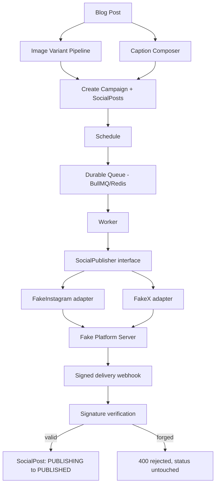

# Architecture

## Layers

```
HTTP (Express)  →  Application (use cases)  →  Domain  →  Ports  →  Infrastructure adapters
```

- **`src/domain/`** — pure types and business rules with zero I/O: platform specs, the
  `SocialPost` state machine, campaign error factories. Nothing here imports Express,
  Prisma, or any adapter.
- **`src/application/`** — use cases that orchestrate domain rules against ports:
  `createCampaign`, `scheduleCampaign`, `publishSocialPost`, `handleSocialDeliveryWebhook`.
  These depend on repository/port *interfaces*, not concrete infrastructure classes.
- **`src/infrastructure/`** — concrete implementations: Prisma repositories, the Redis/BullMQ
  queue, AES-256-GCM token cipher, HMAC webhook signature verification, the image pipeline,
  and the two platform adapters.
- **`src/interfaces/http/`** — Express routes/controllers/middleware/Zod schemas. Thin: a
  controller parses+validates, calls one use case, maps the result to an HTTP response.

## The adapter boundary (§5 / §10 of the build spec)

```typescript
interface SocialPublisher {
  publish(input: PublishInput): Promise<PublishResult>;
  getStatus(input: StatusInput): Promise<PublishStatus>;
}
```

`FakeInstagramPublisher` and `FakeXPublisher` are the only two files that know the fake
platform's request/response shape. `publisher-registry.ts` is the only file that imports both
adapter classes; everything else resolves a publisher by `Platform` through the registry.
**Adding a third platform means: one spec entry in `domain/platform/platform.ts`, one adapter
class, one registry entry — zero changes to `application/`.**

## Data flow



## Why status only flips to PUBLISHED on a verified webhook

A 2xx from the fake platform's `/publish` endpoint means "accepted for delivery," not
"delivered." Treating it as final would make the system lie about its own reliability the
first time a platform silently drops a post after accepting it. `publish-social-post.usecase.ts`
therefore leaves the row in `PUBLISHING` after a successful call; only
`handle-social-delivery-webhook.usecase.ts`, after verifying the HMAC signature over the raw
body, is permitted to move it to `PUBLISHED` (or `FAILED`) — enforced by the whitelist in
`domain/social-post/social-post-status.ts`.
