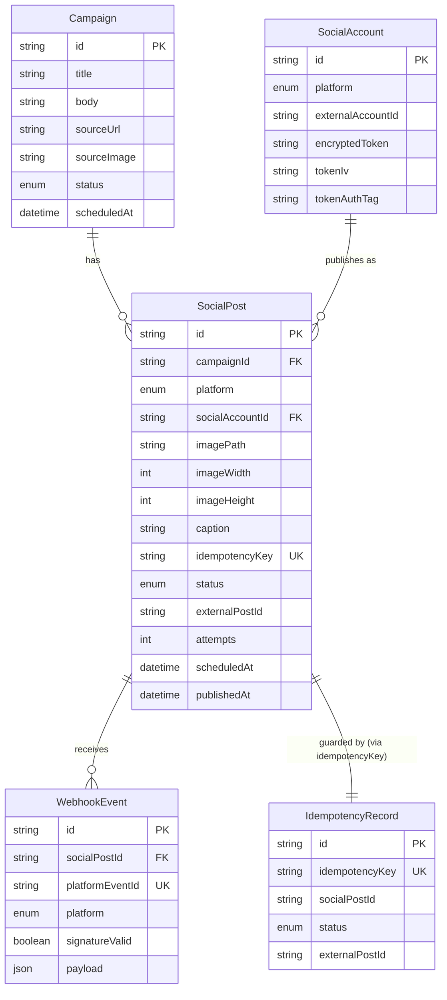

# Database

PostgreSQL via Prisma. Schema: `prisma/schema.prisma`; hand-verified initial migration:
`prisma/migrations/000001_init/migration.sql`.

## ER diagram

## Invariants enforced at the database level (not just application code)

- `SocialPost.idempotencyKey` — `UNIQUE`. Two processes racing to create the same logical
  publish request can never end up with two rows.
- `SocialPost.(campaignId, platform)` — `UNIQUE`. One post per platform per campaign, period.
- `IdempotencyRecord.idempotencyKey` — `UNIQUE`. The idempotency ledger itself cannot be
  double-inserted.
- `WebhookEvent.platformEventId` — `UNIQUE`. Replay protection: a re-delivered webhook is a
  no-op, enforced by the database, not just an in-memory check.
- Foreign keys with explicit `ON DELETE` behavior (`CASCADE` for `SocialPost.campaignId`,
  `SET NULL` for `WebhookEvent.socialPostId`) so referential integrity survives cleanup.

## Indexes

`Campaign.status`, `Campaign.scheduledAt`, `SocialPost.status`, `SocialPost.scheduledAt`,
`WebhookEvent.signatureValid` — all support the query patterns actually used by the worker's
recovery sweep and the campaign-status dashboard read path.
