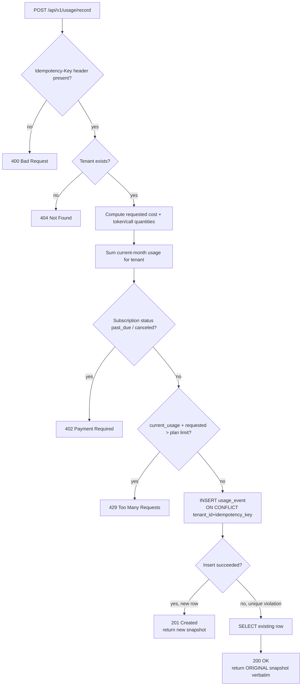
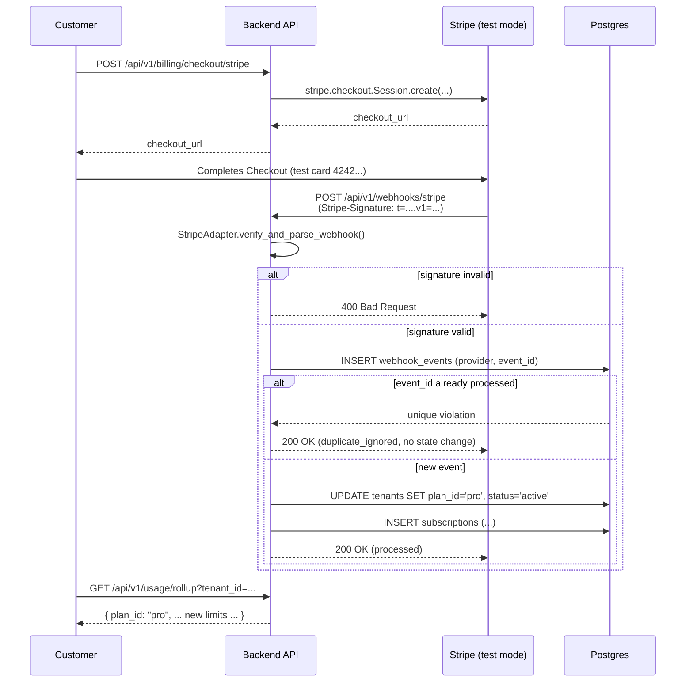

# Usage Metering & Billing Engine

FlyRank Backend Internship Capstone. A small, correct backend service that answers the three
questions every SaaS product has to answer: how much has this customer used, what does it cost,
and have they hit their limit — with exactly-once metering under retries, honest 429/402
boundaries, integer money math for AI-token pricing, and signature-verified, idempotent Stripe
webhooks (plus a modular local-mock payment adapter as a second provider).

## 1. System overview & architecture

**Stack:** Python 3.12, FastAPI, SQLAlchemy 2.0 (async) + asyncpg, PostgreSQL 16, Docker Compose.

**Layering** (HTTP never talks to the database directly):

```
app/routers/*.py        <- HTTP / route layer (FastAPI). Validates input, maps
                            service outcomes to status codes. No business logic.
app/services/*.py       <- Service / business-logic layer. MeteringService,
                            QuotaService, CostService, PaymentService. Framework-
                            agnostic — QuotaService and CostService have zero
                            third-party imports at all.
app/services/adapters/  <- Modular Payment Gateway Adapter Pattern. StripeAdapter
                            and LocalMockAdapter both implement PaymentAdapter;
                            swapping/adding a provider never touches the service
                            or route layers.
app/models.py            <- Data access layer (SQLAlchemy ORM models).
migrations/schema.sql    <- Source of truth for the schema, incl. the UNIQUE
                            constraints that back the idempotency guarantees.
```

**The idempotency guarantee, precisely:** `usage_events` has a `UNIQUE(tenant_id,
idempotency_key)` constraint. `MeteringService.record()` never does "check if it exists, then
insert" — that has a race window between two concurrent retries. It always attempts the INSERT
and treats a uniqueness violation as "someone already won this key," then reads back and returns
that winning row's snapshot. The database's constraint is the actual guarantee; the code just
reacts to it correctly. The same pattern secures webhook deduplication via
`UNIQUE(provider, provider_event_id)` on `webhook_events`.

**Money math:** every monetary value is an integer number of **micro-cents** (1 cent = 10,000
micro-cents). Never a float, anywhere, including in the database column types (`BIGINT`). See
`app/pricing.py` for why micro-cents rather than plain cents (per-token AI pricing is fractions of
a cent).

### Mermaid — Metering & Quota Enforcement Path



### Mermaid — Payment Checkout & Signature-Verified Webhook Flow



## 2. Setup & run instructions

```bash
git clone <your-repo-url> flyrank-capstone-metering-billing
cd flyrank-capstone-metering-billing
cp .env.example .env               # fill in Stripe test keys + a random LOCAL_MOCK_WEBHOOK_SECRET

docker compose up --build          # starts Postgres (schema auto-applied) + the API on :8000

# in a second terminal, seed demo data (plans + a tenant sitting at 999/1000 quota):
docker compose exec app python -m app.seed

# run the full test suite:
docker compose exec app pytest -v
```

`capstone.yaml` documents these same commands in the manifest the evaluator reads.

### Manual smoke test

```bash
# create a fresh tenant
curl -s -X POST localhost:8000/api/v1/tenants -H 'Content-Type: application/json' \
  -d '{"name": "Acme Inc"}'
# => {"tenant_id": "...", "name": "Acme Inc", "plan_id": "free"}

curl -s -X POST localhost:8000/api/v1/usage/record \
  -H 'Content-Type: application/json' -H 'Idempotency-Key: demo-1' \
  -d '{"tenant_id": "<id>", "usage_type": "api_call", "api_call_qty": 1}'
```

## 3. Local webhook testing guide

### Stripe CLI (Provider 1)

```bash
stripe login
stripe listen --forward-to localhost:8000/api/v1/webhooks/stripe
# copy the printed whsec_... into .env as STRIPE_WEBHOOK_SECRET, then restart the app

# in another terminal, replay events without clicking through Checkout:
stripe trigger checkout.session.completed
stripe trigger customer.subscription.updated
stripe trigger customer.subscription.deleted
```

For a real end-to-end Checkout flow: `POST /api/v1/billing/checkout/stripe?tenant_id=<id>`,
open the returned `checkout_url`, pay with test card `4242 4242 4242 4242` / any future expiry /
any CVC, and watch the webhook flip the tenant to Pro.

### Local Mock runner (Provider 2)

No Stripe account or CLI needed — this simulates a local wallet-style processor end-to-end:

```bash
export LOCAL_MOCK_WEBHOOK_SECRET=<same value as in .env>
python scripts/simulate_local_webhook.py activate <tenant_id>
python scripts/simulate_local_webhook.py cancel <tenant_id>

# proof of forged-signature rejection:
python scripts/simulate_local_webhook.py activate <tenant_id> --bad-signature
# proof of duplicate-delivery dedup:
python scripts/simulate_local_webhook.py activate <tenant_id> --replay
```

## 4. Known limitations & edge cases

- **No proration, invoicing, or overage billing** in the core scope — these are explicitly listed
  as stretch goals in the brief (§ 9) and are out of scope here.
- **Quota boundary rule is pinned as "the boundary value is always reachable."** A request that
  would land current usage exactly on the limit is **allowed**; only a request that would exceed
  it is rejected. See `app/services/quota_service.py` module docstring for the full reasoning and
  `tests/test_quota_boundaries.py` for the 999/1000/1001 proof.
- **402 is reserved for subscription-status problems** (`past_due` / `canceled` / `incomplete`),
  never fired purely from having a lot of remaining quota volume — a Free tenant with 0 quota left
  gets 429, not 402, because their subscription itself is fine; they're just out of allowance.
- **Cached tokens still count toward the quota**, even though they cost less — quota is a volume
  limit, not a spend limit. Only the *cost* calculation discounts them.
- **Reasoning tokens are billed at the output rate and counted in the output bucket** — there is
  no separate "reasoning" price tier, per the brief's pricing rule.
- **Webhook replay tolerance** for Stripe signatures is 300 seconds (Stripe's own default) — an
  otherwise-valid signature on a very old timestamp is rejected as a possible replay, independent
  of the event-ID deduplication table.
- **Single-currency (USD).** Multi-currency would need a currency column and per-currency pricing
  tables; not attempted here.
- **No authn/authz on the metering endpoint itself** in this capstone's core scope — the brief's
  focus is metering/quota/cost correctness, not API-key management. In a real deployment, tenant
  identity would come from a validated API key, not a client-supplied `tenant_id` field. Documented
  here rather than silently shipped as if it were production-secure.
- **Test suite runs against SQLite, not Postgres**, so `pytest` needs zero external services. See
  `BUILDLOG.md` for why, and `app/time_utils.py` for the one query pattern (current-month
  filtering) written to be portable across both databases so behavior is identical.

## 5. Repository layout

```
.
├── app/                     # application code (see layering above)
├── migrations/schema.sql    # Postgres schema, source of truth
├── tests/                   # pytest suite (unit + integration)
├── scripts/
│   ├── simulate_local_webhook.py   # "stripe trigger" equivalent for the local mock provider
│   └── verify_core_logic.py        # standalone dependency-free verification (see BUILDLOG.md)
├── docker-compose.yml / Dockerfile
├── requirements.txt
├── .env.example
├── capstone.yaml
├── EVIDENCE.md
└── BUILDLOG.md
```
