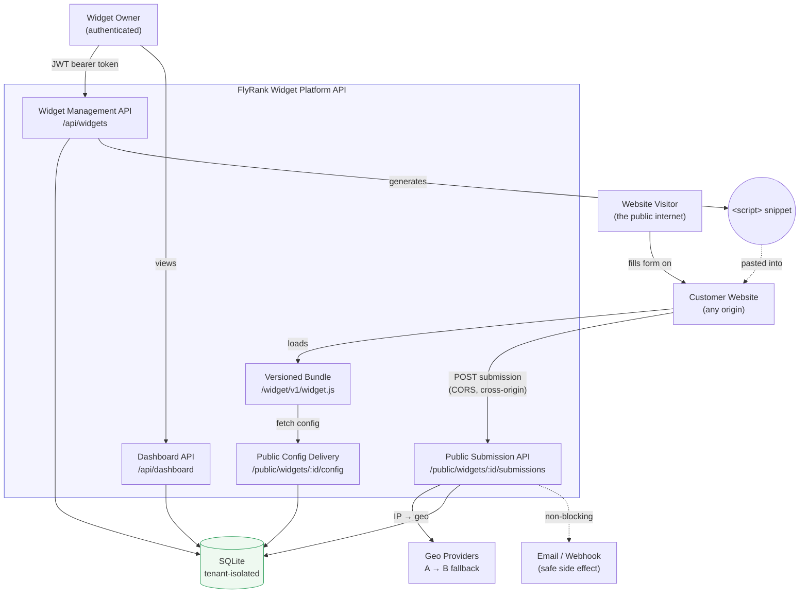
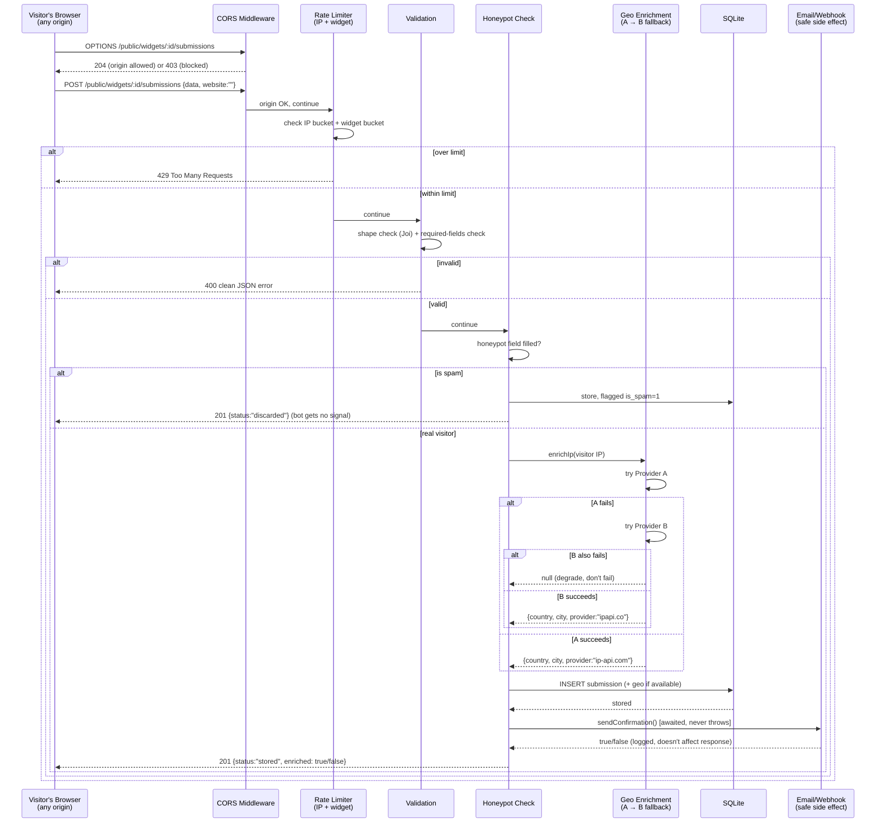
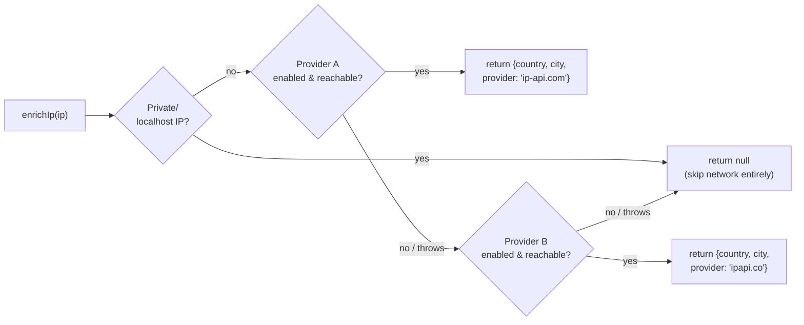

# FlyRank Capstone — Embeddable Widget & Lead-Capture Platform

Let a customer define a widget, hand them one line of `<script>`, and safely
catch everything the public internet throws back — validated, spam-filtered,
enriched, and dashboarded.

**Stack:** Node.js · Express · SQLite (zero-setup) · vanilla-JS embed bundle
**Status:** Core (§6 Definition of Done) — all boxes ticked, 37/37 automated
tests passing.

---

## Contents

- [Architecture](#architecture)
- [Quick start](#quick-start)
- [The five moving parts](#the-five-moving-parts)
- [Request flows (diagrams)](#request-flows)
- [API reference](#api-reference)
- [Resilience & security design](#resilience--security-design)
- [Testing](#testing)
- [Demo script (§13)](#demo-script)
- [Screenshots to capture for EVIDENCE.md](#screenshots-to-capture-for-evidencemd)
- [Project layout](#project-layout)
- [Swapping the DB for Postgres](#swapping-the-db-for-postgres)
- [Honest limitations](#honest-limitations)

---

## Architecture

Three actors, three request paths, kept deliberately separate in the code
(`src/modules/widgets`, `src/modules/public`, `src/modules/dashboard`) so
none of them accidentally trusts the others' assumptions:



**Why this shape:** the owner never talks to the same endpoints a visitor
does. The visitor's browser is untrusted by definition — it's on a website
we don't control, running whatever script or automation someone pointed at
our API. Every public route (`/public/*`, `/widget/*`) is written as if it
will be attacked, because per the brief, it will be.

---

## Quick start

### Option A — Docker (recommended, one command)

```bash
git clone <your-repo-url> flyrank-capstone-widget-platform
cd flyrank-capstone-widget-platform
docker compose up --build
```

This starts **two** containers:
- `api` — the platform, on `http://localhost:4000`
- `test-site` — the "customer website," on `http://localhost:5500`, serving
  `test-site/index.html` as a genuinely separate origin

Then seed demo data and copy the widget id into the test page:

```bash
docker compose exec api npm run seed
# copy the printed widget id into test-site/index.html's data-widget-id
```

Open `http://localhost:5500` — the widget should render bottom-right.

### Option B — Local Node (no Docker)

```bash
npm install
cp .env.example .env
npm run seed        # creates demo user + widget + sample submissions, prints the widget id
npm run dev          # http://localhost:4000
```

In a second terminal, serve the customer test page on a **different port**
(a genuinely different origin — this is the point):

```bash
npm run test-site    # http://localhost:5500
```

Paste the widget id `npm run seed` printed into
`test-site/index.html`'s `data-widget-id` attribute, then open
`http://localhost:5500`.

### Running the tests

```bash
npm test
```

---

## The five moving parts

| # | Part | Route(s) | What it teaches |
|---|------|----------|------------------|
| 1 | Widget management API | `POST/GET/PATCH/DELETE /api/widgets` | Multi-tenant CRUD + auth |
| 2 | Embed snippet generation | `GET /api/widgets/:id/embed` | Developer experience |
| 3 | Cached widget delivery | `GET /public/widgets/:id/config`, `GET /widget/v1/widget.js` | HTTP caching + versioned assets |
| 4 | Public submission endpoint | `POST /public/widgets/:id/submissions` | CORS + boundary validation |
| 5 | Protection, enrichment, safe side effects | (inside the submission handler) | Abuse resistance + graceful degradation |
| 6 | Owner dashboard API | `GET /api/dashboard/*` | Aggregation queries |

---

## Request flows

### 1. Owner creates a widget and gets the embed snippet

```mermaid
sequenceDiagram
    participant O as Widget Owner
    participant API as Widget Management API
    participant DB as SQLite

    O->>API: POST /api/auth/register {email, password}
    API-->>O: 201 {token}
    O->>API: POST /api/widgets {title, fields, ...} + Bearer token
    API->>DB: INSERT widget (tenant-scoped to user_id)
    DB-->>API: widget row
    API-->>O: 201 {widget}
    O->>API: GET /api/widgets/:id/embed + Bearer token
    API-->>O: 200 {snippet: "&lt;script src=... data-widget-id=...&gt;"}
    Note over O: Pastes snippet into their customer's site builder
```

### 2. The hardened public submission path (the core of the capstone)



### 3. Provider fallback chain, isolated



---

## API reference

Base URL: `http://localhost:4000` (or your deployed `BASE_URL`).

### Auth (public)

| Method | Path | Body | Notes |
|---|---|---|---|
| POST | `/api/auth/register` | `{email, password}` | `password` ≥ 8 chars. Returns `{token, user}`. |
| POST | `/api/auth/login` | `{email, password}` | Returns `{token, user}`. |

### Widget management (`Authorization: Bearer <token>` required)

| Method | Path | Body | Notes |
|---|---|---|---|
| GET | `/api/widgets` | — | Lists **only** the caller's widgets. |
| POST | `/api/widgets` | `{type, title, description?, fields[], buttonText?, displayOptions?}` | `type` ∈ `signup_form`/`cta_popover`/`contact_form`. |
| GET | `/api/widgets/:id` | — | 404 if it isn't yours (never leaks existence). |
| PATCH | `/api/widgets/:id` | partial widget body | Bumps `version` → busts the config cache. |
| DELETE | `/api/widgets/:id` | — | 204 on success. |
| GET | `/api/widgets/:id/embed` | — | Returns the `<script>` snippet. |

### Public delivery & submission (no auth — this is the internet-facing surface)

| Method | Path | Notes |
|---|---|---|
| GET | `/public/widgets/:id/config` | `Cache-Control: max-age=60`, `ETag`. CORS scoped per widget. |
| GET | `/widget/v1/widget.js` | `Cache-Control: immutable, max-age=1yr`. CORS: `*`. |
| OPTIONS | `/public/widgets/:id/submissions` | Explicit preflight handler — see `widgetCors` middleware. |
| POST | `/public/widgets/:id/submissions` | Body: `{data: {...fields}, website?: "", idempotencyKey?: "..."}`. `website` is the honeypot — always send it empty from real forms. |

### Dashboard (`Authorization: Bearer <token>` required)

| Method | Path | Notes |
|---|---|---|
| GET | `/api/dashboard/overview` | Per-widget submission/spam counts for the caller. |
| GET | `/api/dashboard/widgets/:id/submissions?limit=&offset=` | Paginated, spam excluded. |
| GET | `/api/dashboard/widgets/:id/stats` | Totals, daily counts (30d), geo breakdown. |

### Debug (demo-only — auto-disabled when `NODE_ENV=production`)

| Method | Path | Body |
|---|---|---|
| GET | `/debug/status` | — |
| POST | `/debug/providers/:name/toggle` | `{status: "up"\|"down"}`, `name` ∈ `A`/`B` |
| POST | `/debug/email/toggle` | `{status: "up"\|"down"}` |

---

## Resilience & security design

These are the three genuinely hard parts the brief calls out, and how this
codebase answers each one:

- **CORS.** `src/middleware/widgetCors.js` resolves the widget *before*
  deciding CORS headers, so behavior is per-widget: open by default (any
  origin, matching how Intercom/Mailchimp widgets actually work), or locked
  to an explicit `allowedOrigins` allow-list if the owner sets one. Preflight
  is handled explicitly (`router.options(...)`) rather than relying on
  Express's default auto-responder, which would otherwise answer every
  preflight with a blanket 200 before our origin check ever runs.
- **Abuse resistance.** Two independent rate-limit buckets (per-IP, per-widget)
  plus a honeypot field. A flood against one widget doesn't lock out a
  different visitor hitting a different widget from the same NAT'd IP, and
  vice versa.
- **Fail-safe, not fail-open or fail-closed.** Geo enrichment and the email
  side effect both follow the same rule: **a broken dependency degrades the
  response, never destroys it.** `enrichIp()` cannot throw — worst case it
  resolves to `null`. `sendConfirmation()` cannot throw — worst case it
  resolves to `false`, logged, and the submission is already durably stored
  before it's even called.
- **Idempotency.** An optional `idempotencyKey` on submissions is enforced
  with a unique `(widget_id, idempotency_key)` index — a retried request
  (e.g. a flaky mobile connection double-submitting) returns the original
  stored result instead of creating a duplicate lead.
- **Tenant isolation.** Every widget/submission query in
  `src/db/repository.js` that an owner can reach is scoped by `user_id` at
  the SQL level, not filtered in application code after the fact — there is
  no code path that can accidentally return another tenant's row.

---

## Testing

```bash
npm test
```

37 tests across 7 suites, all currently passing:

| Suite | Covers |
|---|---|
| `tests/widgets.test.js` | Auth, widget CRUD, **multi-tenant isolation** |
| `tests/cors-and-config.test.js` | Public config delivery, **CORS preflight**, origin allow-listing |
| `tests/submissions.test.js` | Valid/invalid/**oversized** payloads, **honeypot spam**, **idempotency** |
| `tests/rate-limit.test.js` | Burst → **429**, service stays up for other traffic |
| `tests/enrichment.test.js` | Geo **provider fallback chain**, both-down degradation (axios mocked, per the brief's determinism requirement) |
| `tests/side-effects.test.js` | Email/webhook failure **never blocks** a successful submission |
| `tests/widget-bundle.test.js` | Versioned bundle headers + structural smoke check |

---

## Demo script

Rehearsed order, matching brief §13:

1. `POST /api/auth/register` → `POST /api/widgets` → `GET /api/widgets/:id/embed` — show the generated snippet.
2. Open `test-site/index.html` on port 5500 — the widget renders on a page the API never built.
3. Submit the form — check `GET /api/dashboard/widgets/:id/submissions`, note the geo data.
4. Attack it: an invalid payload (400), a disallowed-origin request if `allowedOrigins` is set (403), a rapid burst (429).
5. `curl -X POST localhost:4000/debug/providers/A/toggle -d '{"status":"down"}' -H 'Content-Type: application/json'` — submit again, Provider B takes over live.
6. `curl -X POST localhost:4000/debug/email/toggle -d '{"status":"down"}' -H 'Content-Type: application/json'` — submit again, it still succeeds. Say it out loud: *"non-critical failures never break the main path."*
7. Close on `GET /api/dashboard/widgets/:id/stats`.

---

## Screenshots to capture for EVIDENCE.md

`EVIDENCE.md` has a placeholder for each one — capture these as you go, not
in a panic at the end:

1. **Widget created** — Postman/curl/Thunder Client response of `POST /api/widgets` showing `201` and the widget body.
2. **Embed snippet** — response of `GET /api/widgets/:id/embed`.
3. **Widget rendered on the customer site** — browser screenshot of `localhost:5500` with the widget popup visible bottom-right, address bar showing port `5500` (proves the second origin).
4. **Browser DevTools → Network tab** — the `OPTIONS` preflight request/response for the submission, headers panel visible (`Access-Control-Allow-Origin`, etc.).
5. **A stored submission with geo data** — `GET /api/dashboard/widgets/:id/submissions` response showing `country`/`city` populated.
6. **413 on oversized payload** — curl/Postman screenshot of a large body returning `413`.
7. **429 during a burst** — terminal output of the rate-limit test, or a curl loop, showing `429` responses.
8. **Honeypot blocking spam** — a submission with `website` filled returning `201 {status:"discarded"}`, then the dashboard list **not** including it.
9. **Provider fallback live** — two terminal panes: left running `debug/providers/A/toggle {"status":"down"}`, right showing the next submission's response with `geo_provider: "ipapi.co"`.
10. **Email failure isolation** — `debug/email/toggle {"status":"down"}` followed by a submission still returning `201`.
11. **`npm test` green run** — full terminal output, `37 passed, 37 total`.
12. **Dashboard stats** — response of `GET /api/dashboard/widgets/:id/stats` showing `byDay` and `byCountry`.

---

## Project layout

```
flyrank-capstone-widget-platform/
├── src/
│   ├── app.js                    # composition root — wires everything together
│   ├── server.js                 # boot: init DB, then listen
│   ├── db/
│   │   ├── pool.js                # SQLite connection singleton
│   │   ├── init.js                # schema (idempotent CREATE TABLE)
│   │   └── repository.js          # ALL SQL lives here (Users/Widgets/Submissions)
│   ├── middleware/
│   │   ├── auth.js                # JWT sign/verify + requireAuth
│   │   ├── widgetCors.js          # per-widget CORS + explicit preflight
│   │   ├── rateLimiter.js         # per-IP + per-widget fixed-window limiter
│   │   └── errorHandler.js        # ApiError + centralized 4xx/5xx JSON
│   ├── services/
│   │   ├── geo.service.js         # provider A→B fallback chain
│   │   └── email.service.js       # safe, non-blocking side effect
│   ├── modules/
│   │   ├── auth/auth.routes.js
│   │   ├── widgets/widgets.routes.js
│   │   ├── public/public.routes.js
│   │   ├── dashboard/dashboard.routes.js
│   │   └── debug/debug.routes.js  # demo-only chaos toggles
│   └── utils/validation.js        # every Joi schema
├── public/widget/v1/widget.js     # the embeddable bundle (vanilla JS, dependency-free)
├── test-site/index.html           # "customer website" — a different origin
├── scripts/seed.js
├── tests/                         # 7 suites, 37 tests
├── docker-compose.yml             # api + test-site, one command
├── Dockerfile
├── capstone.yaml                  # evaluator manifest
├── EVIDENCE.md                    # proof-per-checkbox (fill as you go)
├── BUILDLOG.md                    # honest AI-usage log
└── .env.example
```

---

## Swapping the DB for Postgres

The brief allows SQLite "to start." If you outgrow it:

1. `npm install pg`
2. Rewrite `src/db/pool.js` to export a `pg.Pool` instead of a `better-sqlite3` instance.
3. Rewrite `src/db/repository.js`'s query calls (`db.prepare(...).run/get/all`) to
   `pool.query(...)` — the **function signatures** (`Widgets.findByIdForUser`, etc.)
   stay identical, so nothing in `src/modules/*` has to change. That's the
   payoff of the repository pattern.
4. Add a `postgres` service to `docker-compose.yml` and point `DATABASE_URL` at it.

---

## Honest limitations

Per `BUILDLOG.md`'s spirit — no gold-plating claims:

- Rate limiting is in-memory and per-process. Fine for this capstone and a
  single-instance deployment; would need a shared store (Redis) behind a
  load balancer.
- "Email" is a console log, exactly as the brief's realistic-scope section
  allows — the graded behavior is failure isolation, not inbox delivery.
- The widget bundle covers `text`/`email`/`tel`/`textarea`/`checkbox` field
  types — enough to prove the pattern, not a general-purpose form builder.
- No production CDN/domain/hosting — entirely local, per the brief's
  constraints section.
