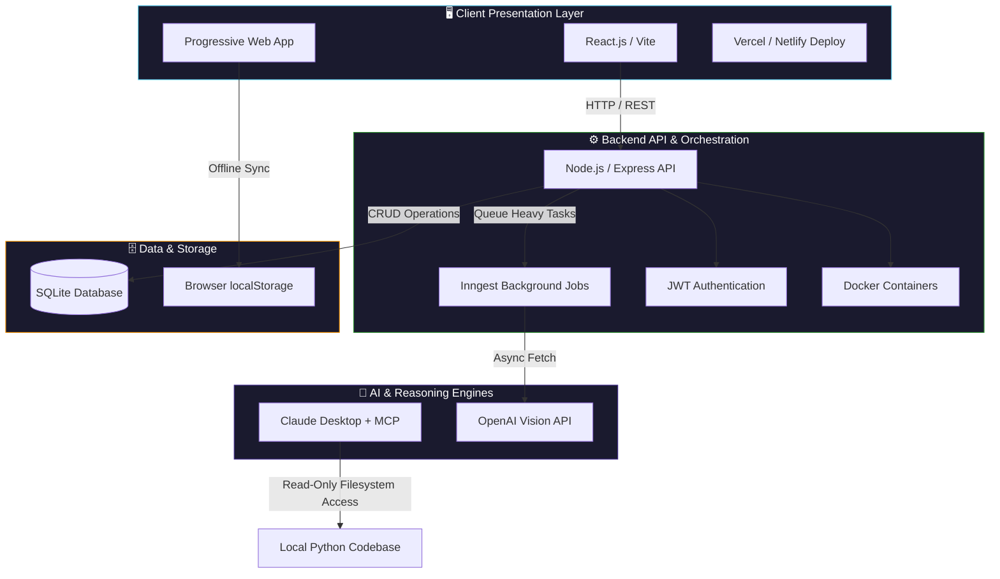
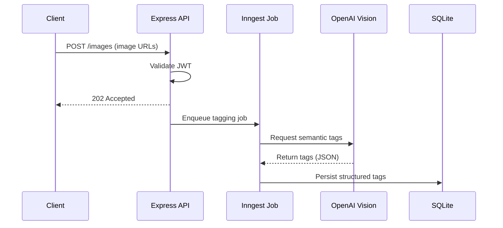

# 🚀 FlyRank Backend & AI Engineering Portfolio

**The complete repository of an 8-week engineering internship building scalable backend systems, autonomous AI agents, and production workflows.**

 

  

---

## 📌 Executive Summary

This repository serves as the living technical deliverable for the **FlyRank Internship Program**. Over the course of 8 weeks, the focus shifted from writing standard server scripts to engineering complex, automated backend architectures, orchestrating containerized deployments, and integrating Agentic AI via the Model Context Protocol (MCP).

> **Core Focus:** Building robust APIs, designing offline-first architectures, managing background task queues, and securely integrating Large Language Models (LLMs) into production workflows.

---

## 🏗️ Technical Ecosystem & Architecture

The diagram below illustrates the overarching technical ecosystem built and utilized across the various modules in this repository.

---

## 🏆 Flagship Projects

### 1️⃣ Image Relevance & Auto-Tagging Engine — *Backend Capstone*

An automated backend ingestion pipeline that replaces manual image tagging workflows using async orchestration.

| | |
|---|---|
| **The Problem** | Unindexed, user-uploaded images bloat storage and make search impossible. Manual tagging doesn't scale. |
| **The Architecture** | An Express API accepts image URLs, validates them with JWT authentication, and immediately returns a `202 Accepted` status. Heavy processing is offloaded to an Inngest background job, which queries the OpenAI Vision API for semantic tags and writes the structured JSON to a SQLite database. |
| **The Impact** | Reduced manual processing time from **20 minutes → 30 seconds** for 50-image batches. |

📄 Documentation: *Explore the Auto-Tagging Engine*

---

### 2️⃣ Defense Scout — *Autonomous Local AI Agent*

A localized AI research assistant built to securely pressure-test academic research on **Hybrid Cloud-Edge Context-Aware QoS Optimization**.

| | |
|---|---|
| **The Problem** | Traditional web-based LLMs pose a data privacy risk for unreleased academic research and lack structural context of local codebases. |
| **The Architecture** | Utilizes Claude Desktop and the Model Context Protocol (MCP). A local File System MCP server grants the agent strict **read-only** access to a local directory containing Python scripts and PDF drafts. |
| **The Impact** | Evaluates reinforcement learning algorithms and generates rigorous panel critiques autonomously — without leaking data to the web. |

📄 Documentation: *Explore Defense Scout*

---

### 3️⃣ Imran Pharmacy — *Progressive Web App*

An offline-first web application designed for rapid, quantity-based medicine ordering.

| | |
|---|---|
| **The Problem** | Pharmacy terminals often suffer from slow internet connections, making cloud-dependent e-commerce interfaces impractical for rapid order building. |
| **The Architecture** | Built as a PWA using **React, Vite, and Zustand**. All state is persisted via `localStorage`. Features client-side `jsPDF` document generation and a 1,908-item static search catalog. |
| **The Impact** | Achieved **sub-second search speeds** and total offline availability, prioritizing a *"Find → Add → Print"* operational workflow. |

📄 Documentation: *Explore Imran Pharmacy*

---

## 🗂️ Complete Deliverable Index

### 🤖 Track 1 — General AI Fluency (Foundations & Agents)

| Module | Focus Area | Status |
|---|---|:---:|
| Week 1: Audit & Proof Statement | AI Workflow Audits & Portfolio Sitemaps | ✅ |
| Week 2: The Prompt Ladder | Prompt Engineering & Real-World Use Cases | ✅ |
| Week 3: Identity Kit | UI Philosophy (Consistency, Not Talent) | ✅ |
| Week 4: MCP Basics | Blank Page Shipped, Tech Stack Rationale | ✅ |
| Week 5: Deployment | Live Deployment & Custom DNS Routing | ✅ |
| Week 6: System Ownership | Explain It Like You Built It & Design Critiques | ✅ |
| Week 7: Mobile QA | Accessibility Fix Logs & Touch Target Sizing | ✅ |
| Week 8: Capstone & Agents | Dynamic Forms, Agent Specs, and Retrospective | ✅ |
| Week 9: Hardening | Security Hardening, SEO, and Custom Domains | ✅ |

### ⚙️ Track 2 — Backend AI Engineering (Core Systems)

| Module | Focus Area | Status |
|---|---|:---:|
| Week 2: CRUD API | Building the first Node.js/Express REST API | ✅ |
| Week 3: Docker & DB | Database Integration & Docker Containerization | ✅ |
| Week 4: JWT Auth | JWT Authentication & Route Protection | ✅ |
| Week 5: Web Scrapers | Polite Web Scrapers & Data Extraction | ✅ |
| Week 6: Background Jobs | Inngest Queues & LLM API Triage | ✅ |
| Week 7: AI Decision Flows | PDF Report Generators & React Flow Logic | ✅ |
| Week 9: 10x Solution | Final Capstone Submission | ✅ |

---

## 👨‍💻 About the Engineer

### Muhammad Abbas
**Backend & Cloud AI Engineer**

Specializing in bridging the gap between scalable cloud infrastructure and autonomous AI workflows. With a deep focus on **Node.js, Python, AWS, and AI orchestration (MCP/RAG)**, building systems that don't just generate text, but actively perform background tasks, manage state, and execute decisions securely.

**Current Research:** Hybrid Cloud-Edge Context-Aware QoS Optimization
**Certifications:** Preparing for Microsoft Azure AI

🔗 [LinkedIn](https://www.linkedin.com/in/abbassafar) · 💻 [GitHub](https://github.com/shatteredcode69)

---

Built with ⚙️ backend rigor and 🤖 AI-assisted engineering — FlyRank Internship, 8-Week Sprint.

